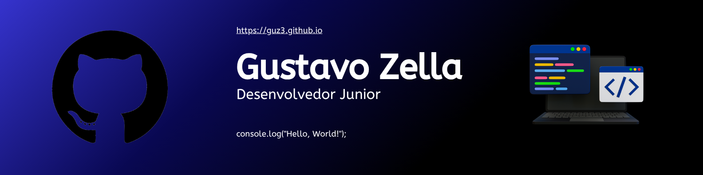
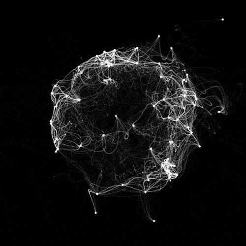

# Gustavo Zella

 

---

##  Sobre mim

• Desenvolvedor em formação com foco em **lógica e Back-End**  
• Experiência acadêmica com **PHP, JavaScript e arquitetura MVC**  
• Sempre estudando e evoluindo  
• Interesse em construir sistemas completos e funcionais  

💼 **Disponível para estágio em desenvolvimento**  

🌐 **Portfólio:**  
 https://guz3.github.io  

 

---

##  Stack Tecnológica

---

##  Estatísticas

 

---

## Diferenciais

Boa base em lógica de programação  
Organização de código (MVC, POO)  
Facilidade em aprender novas tecnologias  
Foco em construção de sistemas reais  

---

## Contato

---

## Contribuições

---

💡 *"Mais importante que saber tudo, é aprender rápido e evoluir sempre."*

